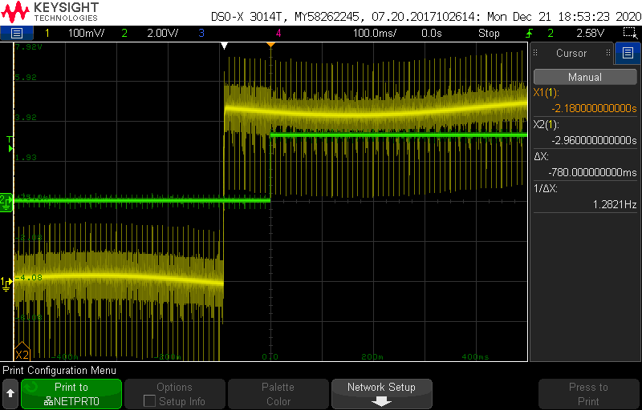

# Control de Versiones
<!-- markdownlint-disable MD033 -->
<!-- markdownlint-disable MD024 -->
## Nomenclatura

Dentro de esta carpeta se encontraran archivos o ficheros que pueden correponder a distintas ramas de trbajo por ello se decide mantener una coeherencia en la nomclatura que antiende a las siguientes reglas:
**Bx_Rx_Vx**

* Bx : Rama principal.
* Rx : Rama secundaria.
* Vx : Version.

Ej: B2_R3_V5. Version 5 de la rama secundaria 3 de la rama principal 2.

## Tabla de Versiones

### B1

| Version |                 Features Added                 |                       Commit                       |      Board       |      IDE       |
| :-----: | :--------------------------------------------: | :------------------------------------------------: | :--------------: | :------------: |
| B1_V15  |           Interaccion con la bateria           |                cebfe41:Merge BAT-96                |    Feather M0    |     VSCODE     |
| B1_V14  |                Alerta de Error                 |                564718c:Merge BAT-95                |    Feather M0    |     VSCODE     |
| B1_V13  |               Aviso Bateria Baja               |                5eac8e8:Merge BAT-94                |    Feather M0    |     VSCODE     |
| B1_V12  |           Temporizador de Inactiidd            |            aae4b20:Merge branch bat 94             |    Feather M0    |     VSCODE     |
| B1_V11  |             Estado de Conexion USB             |                 5d9c458:Version 11                 |    Feather M0    |     VSCODE     |
| B1_V10  |           Modo Sleep y bajo consumo            |  58g65ed:B1_V10_ Sleep Mode & External Interrupt   |    Feather M0    |     VSCODE     |
|  B1_V9  |                   Profiling                    |              db26dc1:B1_V9 Profiling               |    Feather M0    |     VSCODE     |
|  B1_V8  |            Power Bar y Brillo Tenue            |      cf2be86:B1_V8 Power Bar & Low Brightness      |    Feather M0    |     VSCODE     |
|  B1_V7  |         Lectura Capacidad & Fix Error          |    68dcdad:B1_V7 Lectura Capacidad & Fix Error     |    Feather M0    |     VSCODE     |
|  B1_V6  |               Diagnostico Basico               |                   2dbfe4a:B1_V6                    |    Feather M0    |     VSCODE     |
|  B1_V5  |                Sonidos Basicos                 |            07cce4f:B_V5:Buzzers Sounds             |    Feather M0    |     VSCODE     |
|  B1_V4  |  Funcionalidades Basicas Botoneras y Display   |                   001e90f:B1_V4                    |    Feather M0    |     VSCODE     |
|  B1_V3  | Proteccion UnderVoltage y Proteccion OverPower | fab392e:B1_V3: UnderVoltage & OverPower Protection |    Feather M0    |     VSCODE     |
|  B1_V2  | Proteccion SobreCorriente y Tiempo de Arranque |       1028ac8: B1_V2 Consumption Protection        |    Feather M0    | Arduino 1.8.12 |
|  B1_V1  |             Gestion Boost-No Boost             |                   d34e26a: B1_V1                   | Metro M0 express | Arduino 1.8.12 |

## Descripcion de Versiones B1

### v15 Interaccion con la introduccion de la bateria

al insertarse la bateria en el body, es necesario que haya un feedback para el usuario. Se ha decidido de manera inicial, incluir un leve brillo en la pantalla seguido de mostrar el nivel de la bateria.
Tra ello la bateria procederia a apagarse y entrar en el estado de Sleep. Esta interaccion tiene que tener lugar previamente a entra en el ciclo de contro lya que solo se realizara cada vez que la CPU reciba alimentacion.

### v14 Alerta de Error

Cuando una de las protecciones salta, el sistema se dirije el estado de error. Es necesario crear una alerta visual y sonora que alerte al ususario que el fncionamiento no esta siendo el adecuado. Tras reporducir la alerta el sistema se redigira al estado de STOP.

### V13 Aviso Bateria Baja

Siempre que la bateria se encuentre por debajo de cierto voltaje, no se puede asegurar un correcto funcionamiento, debido a que si la maquina que se conecta a la bateria demanda ucha corriente, el voltaje de l abateria puede llegar a caer por debajo de los 2,9V llegando a provocar un apagado de la CPU por fallo en la alimentacion. Por esta razon, se decide incluir un aviso visual y sonoro siempre que al mostrar el porcentaje de bateri, este se enceuntre por debajo del umbral.

La imagen elegida para representar esta falta de bateria es un simbolo de un abateria tachada y parpadeando.

El sonido elegido para representar la falta de bateria son 3 pitidos consecutivos.

### V12 Temporizador de No Uso

Siempre que la bateria se encuentr en el estado de STOP y no se haya pulsado ningun boton ni haya ocurrido un evento, la bateria se apagara automaticamente pasado X tiempo. La finalidad de esta medida es evitar que la bateria se pudiera desgastar al quedarse encendida demasiado tiempo.

Modo Debug incorporado en el Estado USB. Pequeña interfac que permite modificar parametros como activar desactivar menasjes de iniicio o apagado, junto con los sonidos de inicioy apagado.

### V11 Estado de conexion USB

Cuando se conecte el USB al battery pack el chasis reacciona estado en un estadoq ue unicamente mostrara una animacion por el display indicando la conexion, y seguidamente se quedara permanentemente intentando conectarse al puerto serie. Si se consigue conectar al puerto serie,  empezara a retransmitir la informacion del modo diagnostico (Aun por concretar esta informacion.)

Se volvera al modo sleep tras la desconexion del USB.

La deteccion de la conexion y desconexion se realizara mediante una interrupcion hardward.

### V10 Modo Sleep y bajo consumo

Con el fin de aumentar la vida de la bateria, durante el estado de sleep, se introducira al micro en un estado de lowpower o Standby.
Para despertar el micro se utilizara una interrupcion harward provocada por el boton central. Tras el despertar se analiza la rutina de atencion de la interrupcion y se continuara el rpograma justo despues de la intruccion que duerme al micro.

### V9 Profiling

Para poder realizar un perfil de tiempos, se utilizan 6 pines que actualmente no tienen uso para, utilizando un analizador logico, se pueda obersvar el consumo temporal de las distintas funciones como:

* Duracion del ciclo de control.
* Lectura de la botonera.
* Funciones del Buzzer.
* Funciones del Display.
* Funciones de Diagnostico.
* Funcion de la Power Bar.

Debido a esta incoporacion se han realizado un par de correcciones para evitar ciclos de control mas largos de lo necesario.

### V8 Power Bar y Brillo Tenue

Manejo de la barra de potencia, formada por 14 leds puestos en linea recta. Colocada en la parte inferior del Display.
La barra de potencia mostrara de forma grafica el valor de la potencia instantanea, de forma que con un fondo de escala ajustable (incialmente en 2500 mW) y una granularidad de 13 leds, se encienden los leds de manera fluida.

En los estados de inicio, apagado, error y diagnostico, la barra de potencia estara completamente apagada.

Por otro lado, se ha determiando la necesaidad de incluir un modo de brillo tenue que se active a los 5 segundos de que no se produzca ninguna interaccion con la bateria, que disminuya considerablemente el brillo del Display. En el momenot que se pulse cualquiera de los botones, la pantalla recupera el brillo.

La disminucion del brillo solo afecta al estado de Work y Capaciti, deminuyendo el brillo del display y la barra de potencia.

### V7 Lectura Capacidad & Fix Error

Se incluye el calculo de la capacidad de la bateria partiendo de la lectura del voltaje.
Esta lectura de realiza siempre cuando la salida se encuentra descoenctada para evitar que la carga afecte al voltaje, realizando la medida en vacio.
Se situan los extremos en 4,2V y 3,5 como maximo y minimo respectivamente.

Propuesta de muestra de la informacion de la capacidaden 2 lugares:

* En la inicializacion.
* Si se mantiene apretado el boton central, se muestra la capacidad durante un breve tiempo antes de mostrar un mensaje de apagado. Si se mantiene apretado termina entrando en modo sleep.En el caso de soltarse, vuelve al estado previo (Stop/Run).

Se incluye la proteccion del voltage de entrada pera prevenir que la bateria baje por debajo de un umbral que no asegure un correcto funcionamiento del sistema.

Caracteristicas:

* Umbral: 3300 mV.
  
* Tiempo: 500 ms.
  
* Sistema de doble pendiente.

#### Fix Error

Se ha detectado que si no se levanta el boton central, el sistema se enciende y se apaga constantemente.
Como solucion, al apagar se espera a que se levante el boton para permitir volver a pulsar y encencer el sistema.

### V6 Diagnostico Basico

Se decide realizar un seguimeinto de ciertas variables que se consideran de interes. para ello se utuilizan 2 memorias EEPROM, una situada en la parte del chasis y otra en la parte de la bateria.

En la bateria se guardaran datos relacionados con la identidad y vida de la bateria como son:

* Modelo.
* Numero de serie.
* Numero de ciclos/Tiempo de Uso.
* Esstadisticas de uso en voltage y potencia.
* Log de errores que ha podido sufrir.

En el chasis se almacena informacion relacionada con la configuracion del chasis como son:

* Seleccion de los sonidos(Encendido,Run/Stop,Up,Down).
* Voltaje de funcionamiento.
* Numero de serie del chasis.

La consulta de estos datos se realiza por el puerto serie, habiendo leido las memorias previamente.

Libreria Usada: [diagnostic.h](../../0010-LOGGING/DOC/../../bat_sw/0002-%20TEST/0010-LOGGING/DOC/SlowSoftI2CMaster-master/SlowSoftI2CMaster.h)
  
### V5 (Buzzer Sounds)

Se decide añadir el modulo del control del Zumbador/Buzzer. Con este modulo se incorporan sonidos a determinados eventos.
Los sonidos se seleccionaran entra alternativas en una funcion de inicializacion, segun el atributo de entrada.

Los eventos que iran acompañados de sonidos en esta integracion son:

* Inicio.
* Apagado.
* Subida de Voltaje.
* Bajada de Voltaje.
* Run/Stop.

### V4 (Funcionalidades Basicas Botoneras y Display)

Para clarificar la integracion del display y de la botonera y se dividirá la integracion en 2 pasos.

Primero se incluira el display con las funcionalidades de: Mensaje de inicio y visualizar Voltaje.

Y luego, se incluira la botonera con las funcionalidades de : Subir/bajar voltaje y Run/Stop.

#### V4.1 *Display*

La parte del display integrara 2 funcionalidades.

**Funcionalidades.**

* Mensaje de Inicio: Al encendido de la bateria se mostrara en la pantalla una cadena de caracteres predeterminada.
* Visualizar Voltaje: En el ciclo de control se mostrara en la pantalla el voltaje con el siguiente formato:

**Librerias usadas:**

* Display ("*display.h*","*bitmaps.h*").
* Dpad ("*Dpad.h*")

**Test.**

##### V4 *Display & Buttons*

**Funcionalidades.**

* State Machine: Diferenciacion de distintos estados y las condiciones de cambio correspondientes:
  * Initialization: Mesnaje de bienvenida y arranque.
  * Run: Voltaje por display y activacion de la salida.
  * Stop: Voltaje por Display y salida desactivada.
  * Sleep: Mensaje de despedida y bateria "apagada".
  * ERROR: Mensaje de error.

* Subida y bajada de voltaje con los botones.
* Activacion y desactavacion de la salida con los botones.

---

### V3 (Proteccion UnderVoltage y Proteccion OverPower.)

Se creean 2 helathMonitor independientes para cada proteccion.
El funcionamiento de estas protecciones son equivalentes a la proteccion de sobreconsumo.

Supuestos:

* **Voltage.** Sucederá si la máquina se queda bloqueada y el DCDC no puede mantener la salida.
* **Potencia** Considerando la Vout la teórica, no la Vo_sense (más restrictivo).

**Caracteristicas.**

* Proteccion de UnderVoltage.
  * Umbral: 2 Voltios
  * Tiempo: 1 segundos
  * Sistema de doble pendiente.
* Proteccion de SobrePotencia.
  * Umbral: 4 Watios
  * Tiempo: 2 segundos
  * Sistema de doble pendiente.

**Test.**

---

### V2 (Proteccion de sobreconsumo y Tiempo de Arranque)

Un Health Monitor sera el encargado de ir checkeando que el consumo no supera el limite durante un determinado tiempo. En caso de activarse, se abrira un abanico de timepo en que se cortara la salida, tras el cual se volvera a checkear la salida. Si la proteccion salta varias veces, se considerara que la bateria se encuentra en un estado de mal funcionamiento/error. En versiones futuras se crearan las rutinas de atencion correspondientes.

**Supuestos:**

* Supuesto 1: la salida está a 8V, la máquina se queda bloqueada en el arranque (una máquina bloqueada suele consumir unos 500mA bloqueada). 8V*500mA = 4W, lo que estaría en el límite de la primera protección, toda salida por debajo de 8V no haría saltar ninguna protección.
  
* Supuesto 2: el cargador corta y reintenta cada 60ms -> no saltaría esta protección pq la salida no llegararía a subir

* Supuesto 3: Cortocircuito al introducir el conector -> poco tiempo, no saltaría, pero tampoco queremos que salte -> ergo, es bien.
  
**Caracteristicas:**

* Proteccion:

  * Umbral: 450 mA.
  
  * Tiempo: 1500 ms.
  
  * Sistema de doble pendiente.

* Tiempo de Arranque: Durante el tiempo que dura un arranque (200ms aprox.) se desactivaran las comprobaciones de las protecciones.

**Test:**

---

### V1

Gestion y deteccion del modo Boost/No boost. Cuando la corriente de salida sea superior a un umbral durante un determinado timep, se debera activar la salida en modo BOOST, mientras que si se encuentra por debajo del umbral durante otro determinado tiempo, se debera desactivar la salida modo BOOSt.

**Caracteristicas:**

* Umbral: 15 mA

* Tiempo Boost: 100 ms

* Tiempo No Boost: 1s.

**Test:**

